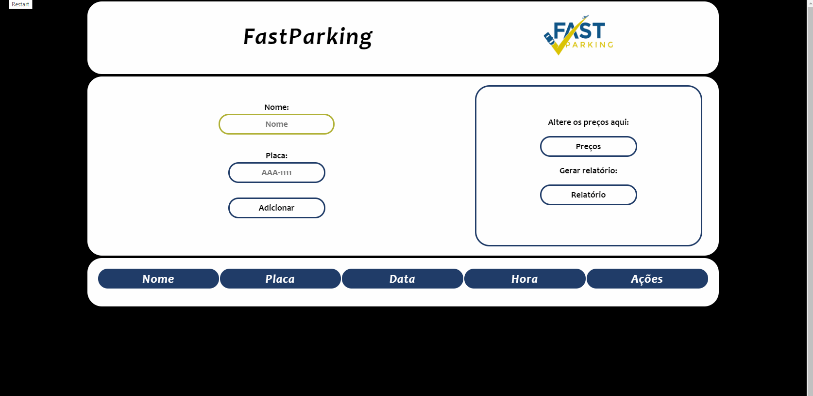

## **Projeto - Estacionamento**

> Este projeto foi voltado como forma de aprendizado para a utilização de Web Storage e uma forma de desenvolver nossos conhecimentos em JavaScript.

##  Pré-requesitos

Nós fomos contratados pela empresa *Fast Parking* para criar um sistema de controle de estacionamento, pois eles mantinham esse controle manual e gerava muitos problemas.

### Funcionalidades

Todas as funcionalidades foram coletadas junto com o cliente:

1. Controle de entrada
    * Armazenar Nome do Cliente, 
    * Placa do veículo, 
    * Data e Horário. 
2. Gerar comprovante de entrada
3. Controle de saída. 
    * Saída do veiculo
    * Calcular valor 
4. Cadastro de preços
    * Valor da primeira hora 
    * Valor das demais horas  
5. Gerar um relatório de rendimentos. 

## Linguagens de programação utilizadas

Era proibido usar algum tipo de framework, então tudo foi criado do zero, as linguagens que foi solicitada era JavaScript, e foi pedido a utilização do Web Storage para gravar os dados.

* HTML e CSS

    Utilizei essas duas linguagens para a estrutura e estilização do sistema.

* JavaScript

    Foi utilizado o JS para realizar toda a parte lógica do sistema.

* Web Storage

    E o web storage para armazenar todo os dados, lembrando que só mantém os dados no seu computador.

#

Criado em: 28/06/2019
